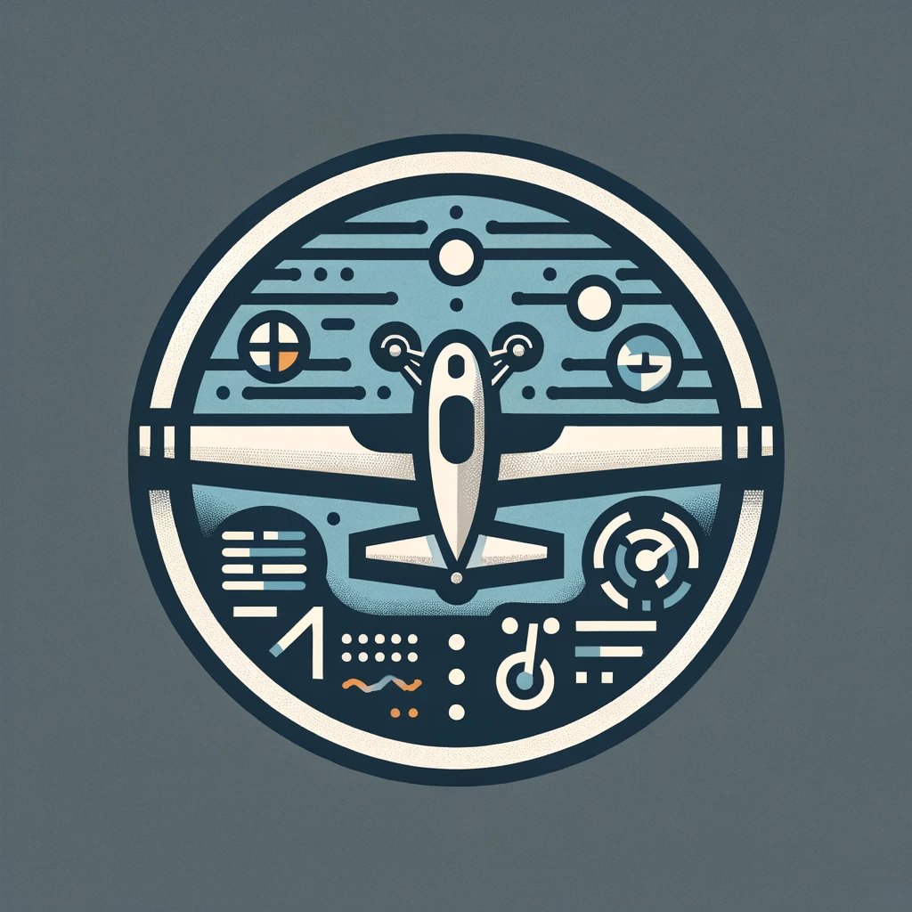
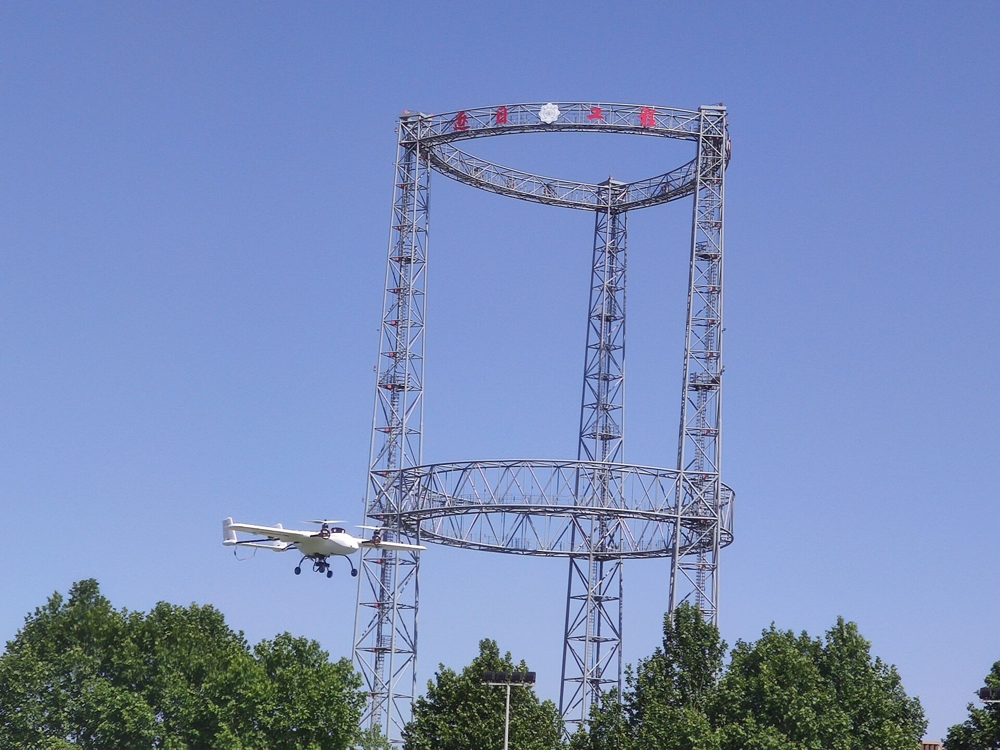
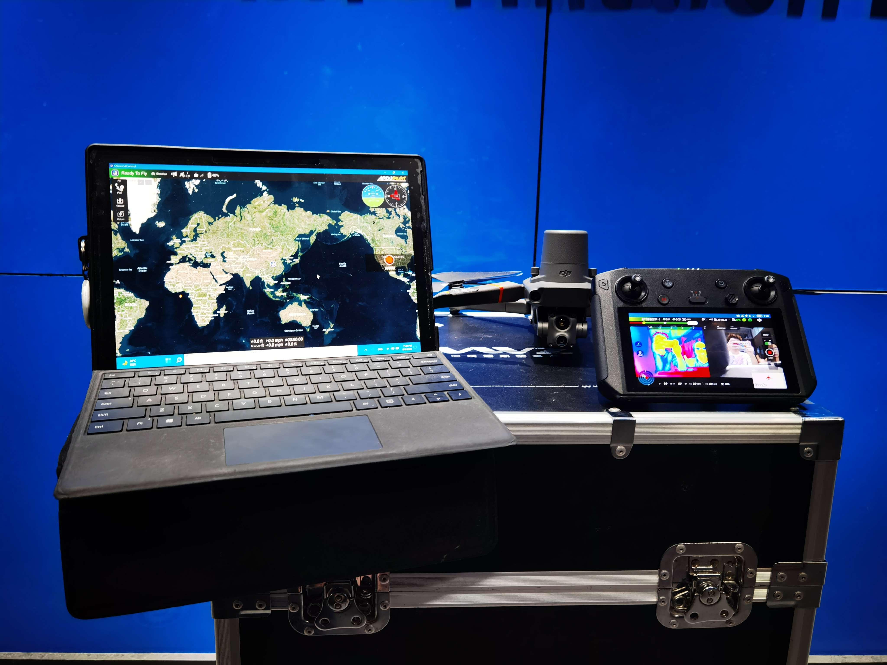
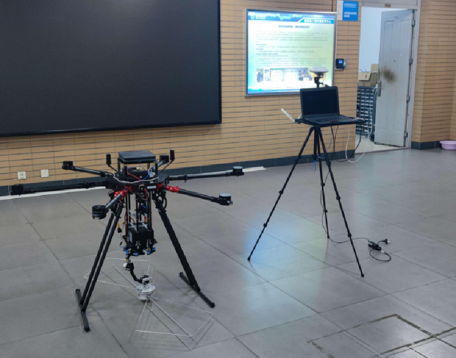
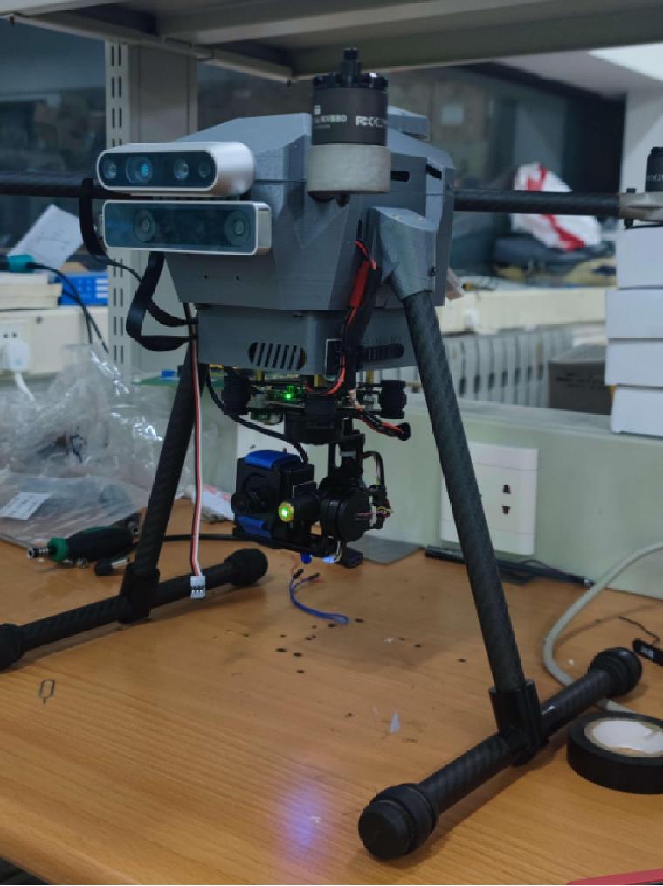
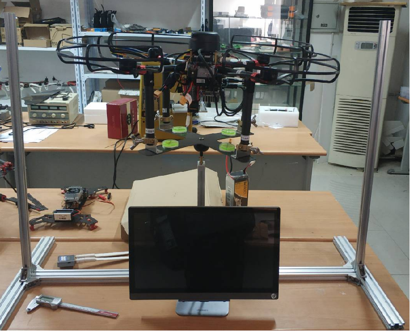
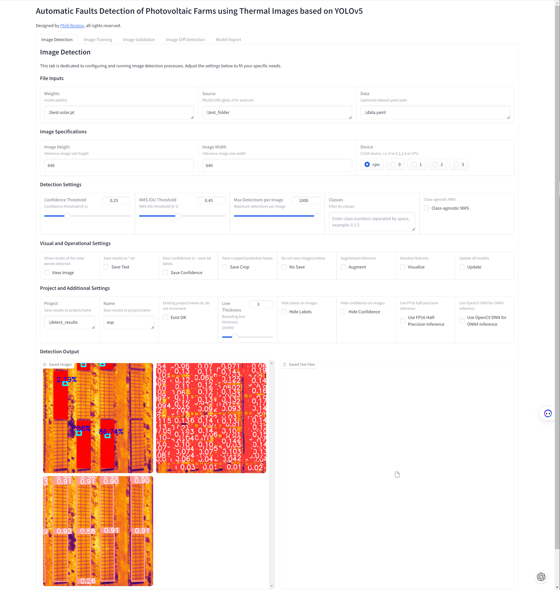
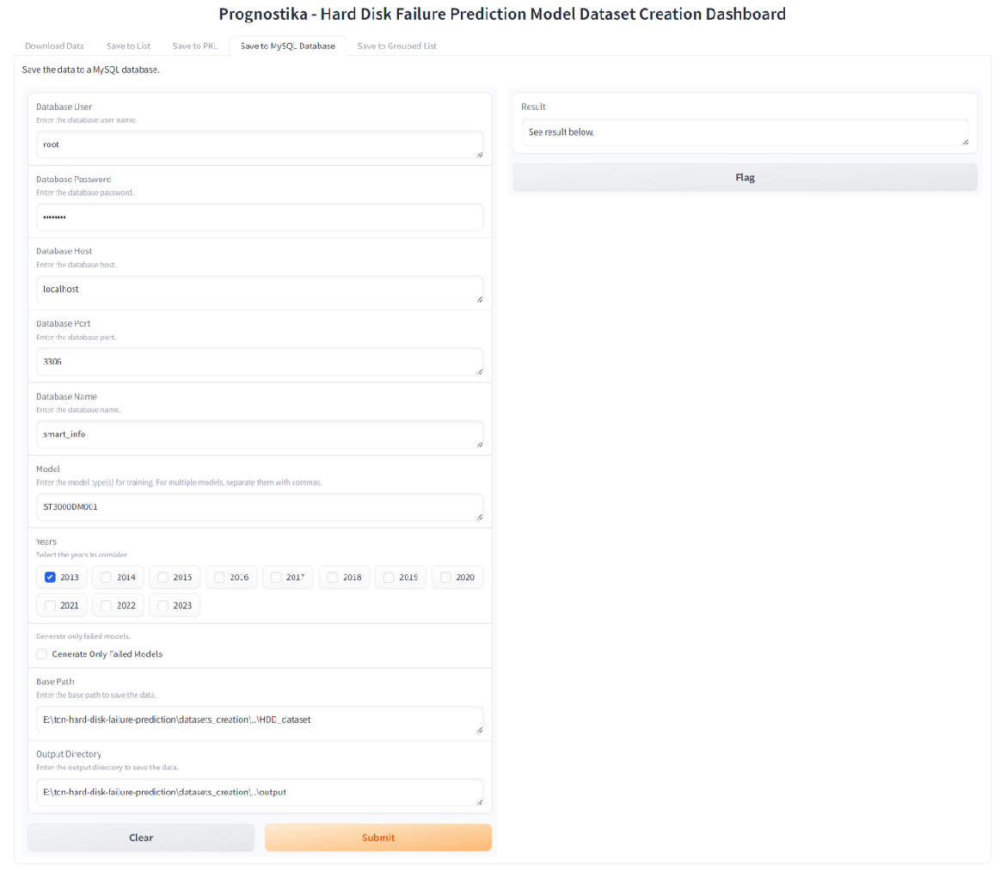
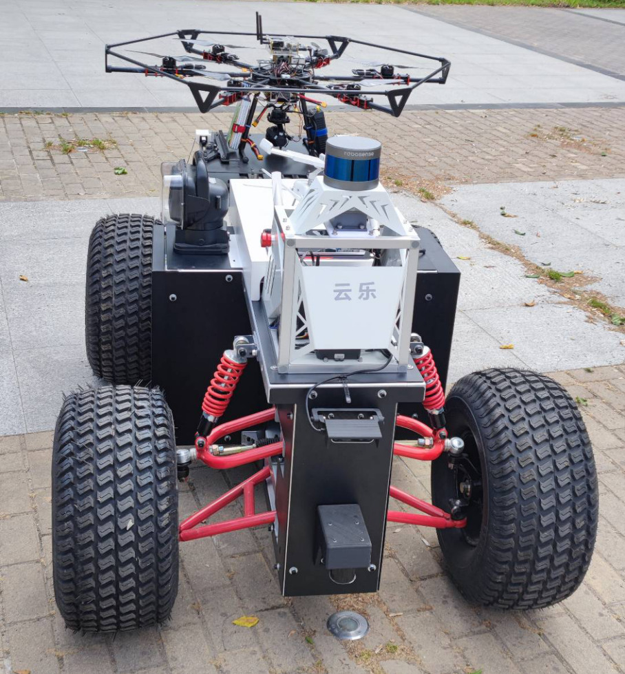
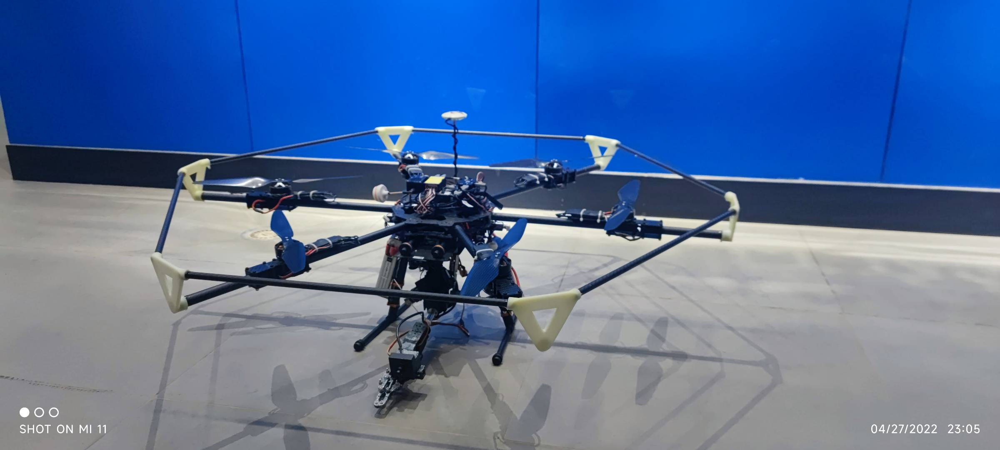

# Phillweston: A Journey in Electronic Information Engineering & Beyond

  

👋 **Welcome to My Space!** I'm Phillweston.

  

🏫 **Academic Background:** Proud alumnus of Xidian University, where I honed my skills and earned a Bachelor's degree in Electronic Information Engineering.

👀 **Passions & Interests:** My academic and professional journey is driven by a deep fascination with Control Theory and Aircraft Navigation & Decision Systems.

🌱 **Research & Innovation:** As part of my undergraduate capstone project, I delved into the realm of Unmanned Aerial Vehicles (UAVs). My research focused on Autonomous Waypoint Flight and developing a cutting-edge Dual-Photothermal Imaging Target Detection Algorithm.

🔧 **My Previous Projects:** I've worked on a series of projects that explore the intersection of Blockchain Technology and AI-based Failure Detection Systems for Hard Drives.

🚀 **Current Focus:** I'm currently focusing on algorithm implementation on FPGA chips to enhancing the parallel speed especially in signal processing and image processing.

📚 **My Past Projects:** Here are some of the projects I've worked on:

  
  
  
  
  
  
  
  
  

## FPGA & Digital Design Projects

- [FPGA Training](https://github.com/Phillweston/fpga_training): A collection of FPGA training materials, including Verilog and VHDL designs.
- [FPGA Projects](https://github.com/Phillweston/fpga_projects): A collection of FPGA projects, including Verilog and VHDL designs.

## UAV & Control Theory Projects

- [DJI Onboard SDK Indoor Location](https://github.com/Phillweston/Onboard-SDK-Indoor-location): Indoor positioning and optical flow self-stabilization of UAV for RoboMaster2020 competition.
- [Drone Master PID](https://github.com/Phillweston/Drone_Master_PID): Main control terminal of educational UAV (PID Version).
- [Drone Master ADRC](https://github.com/Phillweston/Drone_Master_ADRC): Main control terminal of educational UAV (ADRC Version).
- [Drone APP](https://github.com/Phillweston/Drone_APP): Android application of educational UAV
- [Drone Master RC](https://github.com/Phillweston/Drone_Master_RC): RC embedded terminal of educational UAV (PID Version)
- [Drone Simulation](https://github.com/Phillweston/Drone_Simulation): Matlab simulation of educational UAV (PID Version)
- [EGO Planner for PX4 with VINS Fusion](https://github.com/Phillweston/ego_planner_for_px4_with_vins_fusion): EGO Planner for PX4 with VINS Fusion for indoor positioning of UAV.
- [Antenna Tracking Drone Project](https://github.com/Phillweston/Antenna-Tracking-Drone-Project): Antenna tracking drone project cooperated with the antenna department of the School of Electronic Engineering, Xidian University.
- [DJI MSDK Development](https://github.com/Phillweston/DJI_MSDK_Development): DJI MSDK APP development for DJI aircraft.
- [rosettadrone](https://github.com/Phillweston/rosettadrone): The Rosetta Drone 2 Project. Enable Mavlink and H.264 on DJI drones.
- [P450 Experiment](https://github.com/Phillweston/p450_experiment): The P450 Experiment is a project that uses the PX4 flight control system to control the P450 drone in the ROS environment.
- [Prometheus YoloV5 Tracking](https://github.com/Phillweston/Prometheus_YoloV5_Tracking): A modified version including YoloV5 and KCF algorithm for tracking in the Prometheus drone project.

## AI & Machine Learning Projects

- [Disk Failure Prediction](https://github.com/Phillweston/Disk-Failure-Prediction): Using KNN and LSTM to predict hard disk failures.
- [Disk Failure Prediction (New)](https://github.com/Prognostika/tcn-hard-disk-failure-prediction): Using TCN, LSTM and RandomForest to predict hard disk failures.
- [Prognostika Website](https://github.com/Prognostika/prognostika.github.io): The website of "Prognostika - Hard Disk Failure Prediction" project.
- [2021MCM-ICM ipynb](https://github.com/Phillweston/2021MCM-ICM_ipynb): The Jupyter Notebook of the 2021 MCM/ICM competition.
- [2021MCM-ICM LATEX](https://github.com/Phillweston/2021MCM-ICM_LATEX): The Paper of the 2021 MCM/ICM competition.

## Blockchain Related Projects

- [Lotso Website](https://github.com/BTI-US/Lotso): The Lotso Website is an NFT token project that allows users to check their eligibility and claim their tokens.
- [Lotso Twitter Authentication Service](https://github.com/BTI-US/Lotso-Twitter-Auth): The Lotso Twitter Authentication Service is a Twitter-based authentication service and airdrop claim check for the Lotso Website, deployed in the Docker container.
- [BTI Gitbook](https://github.com/BTI-US/BTI-Gitbook): The Whitepaper for the BTI project, detailing the project's vision, mission, and technical specifications.
- [PhotoEditor Website](https://github.com/BTI-US/PhotoEditor-Website): The PhotoEditor Website is a web-based photo editing tool that allows users to upload, edit, and download their photos.

🔧 **Skills & Tools:**

Programming Languages:

Programming Softwares:

Visual Softwares:

🔍 **GitHub Profile Overview:** A detailed snapshot of my contributions and activities on GitHub:

📊 **Programming Languages & Tools:** My technical repertoire, as reflected in my GitHub stats:

🌟 **My GitHub Journey:** Insights into my GitHub activities and achievements:

🌐 **Discover More:** Visit my website for a deeper dive into my projects, thoughts, and professional journey:

- [My Personal Website](https://www.phillweston.xyz/)
- [My Personal Blog](https://docs.phillweston.com/)
- [My CSDN Blog](https://blog.csdn.net/qq_26550927)

📧 **Let's Connect!** Feel free to reach out for collaborations, discussions, or just a chat about technology:

- 📩 QQ: 2436559745
- 📧 Gmail: [lrt2436559745@gmail.com](mailto:lrt2436559745@gmail.com)
- 📧 Outlook: [lrt2436559745@outlook.com](mailto:lrt2436559745@outlook.com)